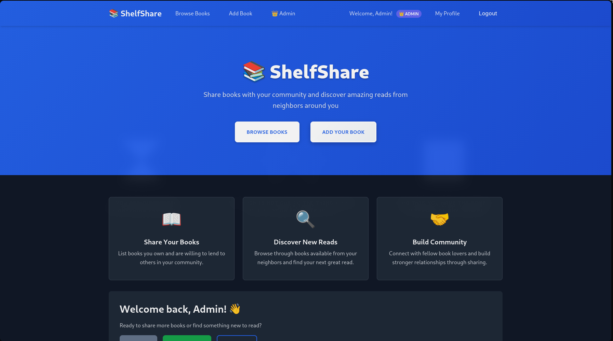

# 📚 ShelfShare

> A modern community book sharing platform that connects neighbors through the love of reading.



## Features

### User Authentication & Profiles
- **Secure User Registration & Login** - Create your account with encrypted email storage
- **Personal Profiles** - View your book collection and sharing statistics
- **Admin Panel** - Administrative controls for user and book management

### Book Management
- **Add Books to Share** - List books you're willing to lend with detailed descriptions
- **Book Discovery** - Browse available books from your community
- **Condition Tracking** - Rate book condition (New, Good, Fair, Poor)
- **Availability Status** - Mark books as available or unavailable for lending
- **Rich Book Details** - Add descriptions, author information, and more

## Technologies Used

- **Backend**: Ruby on Rails 8.0
- **Database**: PostgreSQL
- **Styling**: Modern CSS with CSS Grid and Flexbox
- **Authentication**: Rails built-in secure password handling
- **Security**: CSRF protection, encrypted email storage

## Usage

### For Book Sharers
1. **Sign up** for a ShelfShare account
2. **Add books** you're willing to share with your community
3. **Set availability** - mark when books are available for lending
4. **Manage your collection** - edit details and remove books as needed

### For Book Borrowers
1. **Browse available books** in your area
2. **View book details** including condition and owner information
3. **Contact book owners** to arrange borrowing
4. **Join the community** by sharing your own books

## Development

### Code Structure
```
app/
├── controllers/     # Rails controllers
├── models/         # ActiveRecord models
├── views/          # ERB templates with modern HTML structure
├── assets/
│   └── stylesheets/
│       └── application.css  # CSS with custom properties
└── ...
```

**Happy Reading! 📚✨**
